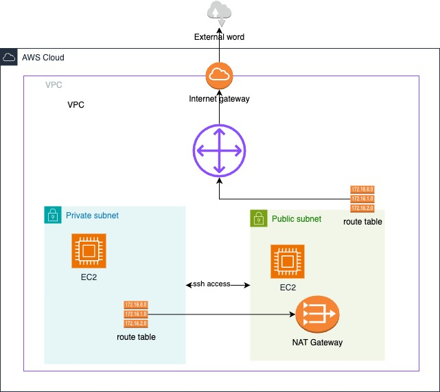

# Networking


## Blogs

- [VPC with servers in private subnets and NAT](https://docs.aws.amazon.com/vpc/latest/userguide/vpc-example-private-subnets-nat.html#create-vpc-private-subnets-nat)


## Youtube

- [AWS Networking Basics For Programmers | Hands On](https://www.youtube.com/watch?v=2doSoMN2xvI)
- [Learn Networking in 3 Hours | Networking Fundamentals + AWS VPC Networking](https://www.youtube.com/watch?v=iSOfkw_YyOU)

- [AWS Regional NAT Gateway (Re:Invent 2025)](https://www.youtube.com/watch?v=7wq1kjiUs8E&list=PLIUhw5xEbE-UhCq45tzYP0x4ZEABQj1R0&index=5)


## Theory

### VPC (Virtual Private Cloud)

A **VPC (Virtual Private Cloud)** is a logically isolated virtual network dedicated to your AWS account. It's like having your own private data center in the cloud where you have complete control over your network configuration. Think of it as your own slice of AWS infrastructure that is completely isolated from other AWS customers, providing you with a secure and customizable networking environment.

**What is a VPC?**

When you create a VPC, you're essentially creating a virtual network that closely resembles a traditional network that you would operate in your own data center, but with the benefits of AWS's scalable infrastructure. Your VPC exists within an AWS Region and can span multiple Availability Zones (AZs) within that region.

**Key Characteristics:**

1. **Isolated Network Environment:**
   - Complete network isolation from other AWS accounts
   - Your resources in one VPC cannot communicate with resources in another VPC unless you explicitly configure connectivity (VPC Peering, Transit Gateway, etc.)
   - Provides a security boundary for your applications

2. **Customizable IP Address Range:**
   - You define the IP address range using CIDR notation (e.g., `10.0.0.0/16`)
   - Choose from private IP ranges defined in RFC 1918:
     - `10.0.0.0/8` (10.0.0.0 - 10.255.255.255)
     - `172.16.0.0/12` (172.16.0.0 - 172.31.255.255)
     - `192.168.0.0/16` (192.168.0.0 - 192.168.255.255)
   - Once set, the VPC CIDR cannot be changed (but you can add secondary CIDRs)

3. **Regional Scope with Multi-AZ Support:**
   - A VPC belongs to a single AWS Region
   - Spans all Availability Zones within that region
   - You can create subnets in different AZs for high availability

4. **Flexible Connectivity Options:**
   - Internet Gateway for public internet access
   - VPN Gateway for encrypted connections to on-premises networks
   - Direct Connect for dedicated private connections
   - VPC Peering for connecting multiple VPCs
   - Transit Gateway for hub-and-spoke network topology
   - PrivateLink for private access to AWS services

**Default VPC vs Custom VPC:**

| Feature | Default VPC | Custom VPC |
|---------|-------------|------------|
| **Creation** | Automatically created in each region | You create manually |
| **CIDR Block** | `172.31.0.0/16` | You choose |
| **Subnets** | One public subnet per AZ | You create and configure |
| **Internet Gateway** | Pre-attached | You attach manually |
| **Route Tables** | Pre-configured with internet route | You configure |
| **Use Case** | Quick testing, getting started | Production workloads |

**Benefits of Using VPC:**

1. **Security:**
   - Network-level isolation
   - Fine-grained security controls with Security Groups and NACLs
   - Private subnets for sensitive resources
   - Flow Logs for network traffic monitoring

2. **Flexibility:**
   - Complete control over network configuration
   - Custom routing policies
   - Multiple layers of security
   - Integration with on-premises infrastructure

3. **Scalability:**
   - Easily scale resources up or down
   - No need to provision physical network hardware
   - Automatic scaling of AWS-managed components (IGW, NAT Gateway)

4. **Cost-Effectiveness:**
   - Pay only for what you use
   - No upfront costs for network infrastructure
   - Reduce on-premises data center costs

**Common Use Cases:**

1. **Multi-Tier Web Application:**
   - Public subnet: Load balancers, web servers
   - Private subnet: Application servers, databases
   - Controlled access through security layers

2. **Hybrid Cloud:**
   - Connect VPC to on-premises data center via VPN or Direct Connect
   - Extend your network into the cloud
   - Gradual migration to cloud

3. **Development/Test Environments:**
   - Isolated environments for different projects
   - Separate production, staging, and development VPCs
   - Cost-effective testing infrastructure

4. **Disaster Recovery:**
   - Backup VPC in different region
   - Replicate critical infrastructure
   - Quick failover capabilities

**Best Practices:**

1. **Plan Your CIDR Blocks:**
   - Choose a CIDR block that won't conflict with your on-premises network
   - Use `/16` for VPC (65,536 IPs) to allow for growth
   - Leave room for future expansion

2. **Use Multiple Subnets:**
   - Create subnets in multiple Availability Zones
   - Separate public and private resources
   - Use different subnets for different tiers (web, app, database)

3. **Implement Security in Layers:**
   - Use both Security Groups and NACLs
   - Apply principle of least privilege
   - Regular security audits

4. **Enable VPC Flow Logs:**
   - Monitor network traffic
   - Troubleshoot connectivity issues
   - Security analysis and compliance

5. **Use VPC Endpoints:**
   - Private connectivity to AWS services (S3, DynamoDB, etc.)
   - Reduce data transfer costs
   - Improve security by keeping traffic within AWS network

**VPC Components:**

- **Subnets:** Segments of VPC IP address range
- **Route Tables:** Define traffic routing rules
- **Internet Gateway:** Connect to the internet
- **NAT Gateway/Instance:** Allow private subnet internet access
- **Security Groups:** Stateful firewall at instance level
- **Network ACLs:** Stateless firewall at subnet level
- **VPC Peering:** Connect VPCs together
- **VPN Gateway:** Encrypted connection to on-premises
- **Elastic IPs:** Static public IP addresses
- **Endpoints:** Private connections to AWS services

```
┌─────────────────────────────────────────────────────────────────┐
│                         AWS Region                              │
│  ┌───────────────────────────────────────────────────────────┐  │
│  │              VPC (CIDR: 10.0.0.0/16)                      │  │
│  │                                                           │  │
│  │  ┌─────────────────────┐   ┌─────────────────────┐      │  │
│  │  │ Availability Zone 1 │   │ Availability Zone 2 │      │  │
│  │  │                     │   │                     │      │  │
│  │  │  ┌──────────────┐   │   │  ┌──────────────┐   │      │  │
│  │  │  │ Public Sub   │   │   │  │ Public Sub   │   │      │  │
│  │  │  │ 10.0.0.0/24  │   │   │  │ 10.0.2.0/24  │   │      │  │
│  │  │  └──────────────┘   │   │  └──────────────┘   │      │  │
│  │  │                     │   │                     │      │  │
│  │  │  ┌──────────────┐   │   │  ┌──────────────┐   │      │  │
│  │  │  │ Private Sub  │   │   │  │ Private Sub  │   │      │  │
│  │  │  │ 10.0.1.0/24  │   │   │  │ 10.0.3.0/24  │   │      │  │
│  │  │  └──────────────┘   │   │  └──────────────┘   │      │  │
│  │  └─────────────────────┘   └─────────────────────┘      │  │
│  └───────────────────────────────────────────────────────────┘  │
└─────────────────────────────────────────────────────────────────┘
```

### CIDR Notation (Classless Inter-Domain Routing)

**CIDR (Classless Inter-Domain Routing)** is a method for allocating IP addresses and routing that replaces the old classful addressing system (Class A, B, C). It provides more flexible IP address allocation and efficient use of IP address space. The notation consists of an IP address followed by a slash and a number (e.g., `10.0.0.0/16`).

**Understanding CIDR Notation:**

The CIDR notation format is: `IP_ADDRESS/PREFIX_LENGTH`

For example: `10.0.0.0/16`
- **IP Address:** `10.0.0.0` (the base network address)
- **Prefix Length:** `/16` (number of bits used for the network portion)
- **Host Bits:** 32 - 16 = 16 bits for host addresses
- **Total IPs:** $2^{16} = 65,536$ addresses

**How CIDR Works:**

IPv4 addresses are 32 bits long, represented as four octets (e.g., 192.168.1.1):
```
Binary:    11000000.10101000.00000001.00000001
Decimal:   192     .168     .1       .1
```

In CIDR `/16`:
- First 16 bits = Network portion (fixed)
- Last 16 bits = Host portion (variable)

```
10.0.0.0/16
└─┬─┘ └─┬─┘
  │     │
  │     └─ Network portion (fixed: 10.0)
  └─ Host portion (variable: 0.0 - 255.255)
```

**CIDR Calculation Examples:**

1. **`10.0.0.0/16`:**
   - Network bits: 16
   - Host bits: 32 - 16 = 16
   - Number of IPs: $2^{16} = 65,536$
   - Range: 10.0.0.0 to 10.0.255.255
   - Netmask: 255.255.0.0

2. **`10.0.0.0/24`:**
   - Network bits: 24
   - Host bits: 32 - 24 = 8
   - Number of IPs: $2^{8} = 256$
   - Range: 10.0.0.0 to 10.0.0.255
   - Netmask: 255.255.255.0

3. **`10.0.0.0/28`:**
   - Network bits: 28
   - Host bits: 32 - 28 = 4
   - Number of IPs: $2^{4} = 16$
   - Range: 10.0.0.0 to 10.0.0.15
   - Netmask: 255.255.255.240

**Common CIDR Blocks Reference:**

| CIDR | Netmask | Host Bits | Total IPs | Usable IPs (AWS) | Common Use |
|------|---------|-----------|-----------|------------------|------------|
| /8   | 255.0.0.0 | 24 | 16,777,216 | 16,777,211 | Very large networks |
| /16  | 255.255.0.0 | 16 | 65,536 | 65,531 | VPC (recommended) |
| /17  | 255.255.128.0 | 15 | 32,768 | 32,763 | Large VPC |
| /20  | 255.255.240.0 | 12 | 4,096 | 4,091 | Large subnet |
| /24  | 255.255.255.0 | 8 | 256 | 251 | Standard subnet |
| /25  | 255.255.255.128 | 7 | 128 | 123 | Small subnet |
| /26  | 255.255.255.192 | 6 | 64 | 59 | Tiny subnet |
| /27  | 255.255.255.224 | 5 | 32 | 27 | Micro subnet |
| /28  | 255.255.255.240 | 4 | 16 | 11 | Minimal subnet |
| /32  | 255.255.255.255 | 0 | 1 | 0 | Single host |

**AWS CIDR Block Constraints:**

1. **VPC CIDR Block:**
   - Minimum size: `/28` (16 IP addresses)
   - Maximum size: `/16` (65,536 IP addresses)
   - Can add up to 5 CIDR blocks per VPC
   - Recommended: `/16` for production VPCs

2. **Subnet CIDR Block:**
   - Must be a subset of VPC CIDR
   - Cannot overlap with other subnets in the same VPC
   - Minimum size: `/28` (16 IPs, 11 usable)
   - Maximum size: Same as VPC CIDR

**Reserved IP Addresses in AWS Subnets:**

AWS reserves **5 IP addresses** in each subnet. For example, in subnet `10.0.0.0/24`:

| IP Address | Purpose | Description |
|------------|---------|-------------|
| 10.0.0.0 | Network address | Identifies the network |
| 10.0.0.1 | VPC router | AWS router for the VPC |
| 10.0.0.2 | DNS server | Amazon DNS server (VPC base + 2) |
| 10.0.0.3 | Reserved | AWS reserves for future use |
| 10.0.0.255 | Broadcast | Network broadcast (not used in VPC but reserved) |

**Usable IPs = Total IPs - 5**

**Subnet Planning Examples:**

**Example 1: Small Web Application**
```
VPC: 10.0.0.0/16 (65,536 IPs)
├── Public Subnet AZ-A:  10.0.0.0/24   (251 usable IPs)
├── Public Subnet AZ-B:  10.0.1.0/24   (251 usable IPs)
├── Private Subnet AZ-A: 10.0.10.0/24  (251 usable IPs)
├── Private Subnet AZ-B: 10.0.11.0/24  (251 usable IPs)
├── DB Subnet AZ-A:      10.0.20.0/24  (251 usable IPs)
└── DB Subnet AZ-B:      10.0.21.0/24  (251 usable IPs)

Total used: 1,536 IPs
Available for growth: 64,000 IPs
```

**Example 2: Microservices Architecture**
```
VPC: 10.0.0.0/16 (65,536 IPs)
├── Public Subnets (Load Balancers):
│   ├── AZ-A: 10.0.0.0/24
│   ├── AZ-B: 10.0.1.0/24
│   └── AZ-C: 10.0.2.0/24
├── Private App Subnets (ECS/EKS):
│   ├── AZ-A: 10.0.10.0/23  (507 usable)
│   ├── AZ-B: 10.0.12.0/23  (507 usable)
│   └── AZ-C: 10.0.14.0/23  (507 usable)
└── Database Subnets (RDS):
    ├── AZ-A: 10.0.20.0/24
    ├── AZ-B: 10.0.21.0/24
    └── AZ-C: 10.0.22.0/24
```

**CIDR Supernetting and Subnetting:**

**Subnetting (dividing a network into smaller networks):**
```
10.0.0.0/16 can be divided into:
├── 10.0.0.0/17   (first half)
└── 10.0.128.0/17 (second half)

Or into /24 subnets:
├── 10.0.0.0/24
├── 10.0.1.0/24
├── 10.0.2.0/24
└── ... (256 subnets total)
```

**Supernetting (combining networks):**
```
10.0.0.0/24 + 10.0.1.0/24 = 10.0.0.0/23
```

**Best Practices for CIDR Planning:**

1. **Start with a /16 for VPC:**
   - Provides 65,536 IPs
   - Plenty of room for growth
   - Easy to subnet

2. **Use Consistent Subnet Sizes:**
   - `/24` for most subnets (256 IPs, 251 usable)
   - `/23` for large subnets (512 IPs, 507 usable)
   - `/25` or `/26` for small, specialized subnets

3. **Leave Gaps for Future Subnets:**
   - Don't use consecutive CIDR blocks
   - Example: Use 10.0.0.0/24, 10.0.10.0/24, 10.0.20.0/24
   - Allows inserting subnets later: 10.0.5.0/24, 10.0.15.0/24

4. **Plan for Multiple Environments:**
   - Dev VPC: 10.0.0.0/16
   - Staging VPC: 10.1.0.0/16
   - Production VPC: 10.2.0.0/16
   - Avoid overlapping CIDRs for VPC peering

5. **Document Your IP Allocation:**
   - Maintain an IP address management (IPAM) spreadsheet
   - Track which subnets are in use
   - Plan for disaster recovery subnets

**Common CIDR Mistakes to Avoid:**

1. ❌ **Using /28 for VPC** - Too small, limits growth
2. ❌ **Overlapping CIDRs** - Prevents VPC peering
3. ❌ **Not accounting for AWS reserved IPs** - Surprises when running out of IPs
4. ❌ **Using all available space** - No room for expansion
5. ❌ **Inconsistent subnet sizing** - Hard to manage and troubleshoot

### Subnets

A **subnet (subnetwork)** is a logical subdivision of an IP network, representing a range of IP addresses within your VPC. Subnets allow you to partition your VPC's IP address space into smaller, more manageable segments. Each subnet is tied to a specific Availability Zone and cannot span multiple AZs, making them fundamental building blocks for creating highly available and fault-tolerant architectures.

**What is a Subnet?**

A subnet is essentially a segment of your VPC where you can place groups of isolated resources. By dividing your VPC into subnets, you can:
- Organize resources by function (web tier, app tier, database tier)
- Implement security boundaries
- Achieve high availability across multiple AZs
- Control routing behavior (public vs private access)

**Key Characteristics of Subnets:**

1. **Single Availability Zone:**
   - Each subnet exists in exactly one AZ
   - Cannot span multiple AZs
   - To achieve HA, create subnets in multiple AZs

2. **CIDR Block Requirements:**
   - Must be a subset of VPC CIDR block
   - Cannot overlap with other subnets in the VPC
   - Size between `/28` (16 IPs) and VPC size
   - Example: VPC `10.0.0.0/16` can have subnets `10.0.0.0/24`, `10.0.1.0/24`, etc.

3. **Reserved IP Addresses:**
   - AWS reserves 5 IPs in each subnet
   - First 4 IPs and last IP are unusable
   - Must account for this in capacity planning

4. **Route Table Association:**
   - Each subnet must be associated with a route table
   - Route table controls where network traffic is directed
   - Multiple subnets can share one route table

**Types of Subnets:**

### Public Subnet

A subnet is considered "public" when it has a route to an Internet Gateway, allowing resources within it to communicate directly with the internet.

**Characteristics:**
- **Route table** contains entry: `0.0.0.0/0` → Internet Gateway
- Resources can have **public IP addresses**
- **Bidirectional** internet connectivity (inbound and outbound)
- Direct communication with the internet

**When to Use Public Subnets:**
1. **Web Servers:** 
   - Frontend applications
   - Static websites
   - Application servers that need direct internet access

2. **Load Balancers:**
   - Application Load Balancers (ALB)
   - Network Load Balancers (NLB)
   - Distribute traffic from internet to backend

3. **Bastion Hosts (Jump Boxes):**
   - SSH/RDP entry points
   - Secure access to private resources
   - Admin and management servers

4. **NAT Gateways:**
   - Must be in public subnet
   - Provides internet access for private subnets

5. **VPN Servers:**
   - OpenVPN, WireGuard
   - Remote access solutions

**Public Subnet Configuration:**
```
Subnet CIDR: 10.0.0.0/24
Availability Zone: us-east-1a
Auto-assign public IPv4: Enabled

Route Table:
+----------------+-------------+
| Destination    | Target      |
+----------------+-------------+
| 10.0.0.0/16    | local       | ← VPC traffic
| 0.0.0.0/0      | igw-xxxxx   | ← Internet traffic
+----------------+-------------+
```

### Private Subnet

A subnet is "private" when it does NOT have a direct route to an Internet Gateway, preventing direct internet access.

**Characteristics:**
- **No direct route** to Internet Gateway
- Resources typically have **private IP addresses only**
- **Outbound** internet access via NAT Gateway/Instance
- **No inbound** internet access
- Enhanced security through isolation

**When to Use Private Subnets:**

1. **Application Servers:**
   - Backend APIs
   - Microservices
   - Business logic tier
   - Processing servers

2. **Databases:**
   - RDS instances
   - ElastiCache clusters
   - DynamoDB (though it's a managed service)
   - Self-managed databases

3. **Internal Services:**
   - Message queues (SQS, RabbitMQ)
   - Job processors
   - Batch processing systems
   - Internal tools and utilities

4. **Sensitive Data Processing:**
   - PCI-compliant applications
   - HIPAA workloads
   - Financial systems
   - Any workload handling sensitive data

**Private Subnet Configuration:**
```
Subnet CIDR: 10.0.1.0/24
Availability Zone: us-east-1a
Auto-assign public IPv4: Disabled

Route Table:
+----------------+-------------+
| Destination    | Target      |
+----------------+-------------+
| 10.0.0.0/16    | local       | ← VPC traffic
| 0.0.0.0/0      | nat-xxxxx   | ← NAT Gateway (optional)
+----------------+-------------+
```

**Subnet Architecture Patterns:**

**Pattern 1: Simple Two-Tier Architecture**
```
VPC: 10.0.0.0/16
├── Public Subnet (AZ-A): 10.0.0.0/24
│   ├── Web Server 1
│   └── Web Server 2
└── Private Subnet (AZ-A): 10.0.1.0/24
    ├── Database Primary
    └── App Server
```

**Pattern 2: High Availability Multi-Tier**
```
VPC: 10.0.0.0/16

Public Tier (DMZ):
├── Public Subnet AZ-A: 10.0.0.0/24
│   ├── Load Balancer 1
│   └── NAT Gateway 1
└── Public Subnet AZ-B: 10.0.1.0/24
    ├── Load Balancer 2
    └── NAT Gateway 2

Application Tier:
├── Private Subnet AZ-A: 10.0.10.0/24
│   ├── App Server 1
│   └── App Server 2
└── Private Subnet AZ-B: 10.0.11.0/24
    ├── App Server 3
    └── App Server 4

Database Tier:
├── Private Subnet AZ-A: 10.0.20.0/24
│   └── RDS Primary
└── Private Subnet AZ-B: 10.0.21.0/24
    └── RDS Standby
```

**Pattern 3: Microservices with EKS/ECS**
```
VPC: 10.0.0.0/16

Public Subnets (Load Balancers):
├── AZ-A: 10.0.0.0/24
├── AZ-B: 10.0.1.0/24
└── AZ-C: 10.0.2.0/24

Private Subnets (Container Hosts):
├── AZ-A: 10.0.10.0/23  (Needs more IPs for pods)
├── AZ-B: 10.0.12.0/23
└── AZ-C: 10.0.14.0/23

Data Subnets (Databases, Cache):
├── AZ-A: 10.0.20.0/24
├── AZ-B: 10.0.21.0/24
└── AZ-C: 10.0.22.0/24
```

**Subnet Sizing Guidelines:**

| Workload Type | Recommended Size | Usable IPs | Use Case |
|---------------|------------------|------------|----------|
| Load Balancer Subnet | /26 or /27 | 59-27 | ALB/NLB endpoints |
| Small App Subnet | /25 | 123 | Small microservices |
| Standard Subnet | /24 | 251 | Most applications |
| Large App Subnet | /23 | 507 | ECS/EKS clusters |
| Database Subnet | /26 | 59 | RDS, ElastiCache |
| Management Subnet | /28 | 11 | Bastion hosts |

**IP Address Calculation Example:**

For subnet `10.0.0.0/24`:
```
Total IPs: 256

Reserved by AWS:
  10.0.0.0   - Network address
  10.0.0.1   - VPC router
  10.0.0.2   - DNS server
  10.0.0.3   - Future use
  10.0.0.255 - Broadcast

Usable IPs: 256 - 5 = 251
Range: 10.0.0.4 to 10.0.0.254
```

**Subnet Best Practices:**

1. **Use Multiple Availability Zones:**
   ```
   ✅ Good: Subnets in us-east-1a, us-east-1b, us-east-1c
   ❌ Bad:  All subnets in us-east-1a only
   ```

2. **Consistent Naming Convention:**
   ```
   Format: {env}-{tier}-{az}-subnet
   Examples:
     prod-public-1a-subnet
     prod-private-app-1a-subnet
     prod-private-db-1a-subnet
   ```

3. **Plan for Growth:**
   - Don't use all available IP space
   - Leave gaps between subnet CIDR blocks
   - Account for future services and scaling

4. **Logical Grouping:**
   - Group by function (web, app, data)
   - Group by security requirements
   - Use CIDR numbering: 10.0.0.x for public, 10.0.10.x for private app

5. **Security Segregation:**
   - Separate sensitive data (databases, PII)
   - Isolate compliance workloads (PCI, HIPAA)
   - Use different subnets for different trust levels

6. **Tagging Strategy:**
   ```
   Name: prod-public-1a-subnet
   Environment: production
   Tier: public
   AZ: us-east-1a
   CostCenter: engineering
   ```

**Common Subnet Mistakes:**

1. ❌ **All Resources in Public Subnet:**
   - Security risk
   - Violates least privilege
   - Better: Use private subnets for backend

2. ❌ **Subnet Too Small:**
   - Running out of IPs
   - Can't scale
   - Must create new subnet and migrate

3. ❌ **No Multi-AZ Design:**
   - Single point of failure
   - No high availability
   - AZ outage = service outage

4. ❌ **Overlapping CIDR Blocks:**
   - Routing conflicts
   - Can't peer VPCs
   - Difficult to troubleshoot

5. ❌ **Inconsistent Subnet Sizing:**
   - Hard to manage
   - Inefficient IP usage
   - Confusing architecture

**Troubleshooting Subnet Issues:**

**Issue:** Instance can't connect to internet
```
Check:
1. Is instance in public subnet?
2. Does instance have public IP?
3. Does route table have IGW route?
4. Are security groups allowing traffic?
```

**Issue:** Running out of IPs in subnet
```
Solutions:
1. Create new larger subnet
2. Use multiple subnets with load balancing
3. Clean up unused ENIs
4. Review IP allocation strategy
```

**Issue:** Can't launch instances in subnet
```
Possible causes:
1. No available IPs
2. Subnet in unavailable AZ
3. AWS account limits reached
4. Incorrect subnet selection
```

```
                      ┌─────────────┐
                      │  Internet   │
                      └──────┬──────┘
                             │
                             ↕
                   ┌─────────────────┐
                   │ Internet Gateway│
                   └────────┬────────┘
                            │
        ┌───────────────────┼────────────────────┐
        │                   │                    │
        │     VPC (10.0.0.0/16)                  │
        │                   │                    │
        │   ┌───────────────┼──────────────┐     │
        │   │ Public Subnet (10.0.0.0/24)  │     │
        │   │               │               │     │
        │   │     ┌─────────↓─────────┐    │     │
        │   │     │   EC2 Instance    │    │     │
        │   │     │  (Public IP)      │────┼─────┼──┐ SSH
        │   │     └───────────────────┘    │     │  │
        │   │               │               │     │  │
        │   │     ┌─────────↓─────────┐    │     │  │
        │   │     │   NAT Gateway     │    │     │  │
        │   │     │  (Elastic IP)     │    │     │  │
        │   │     └─────────┬─────────┘    │     │  │
        │   └───────────────┼──────────────┘     │  │
        │                   │                    │  │
        │   ┌───────────────┼──────────────┐     │  │
        │   │ Private Subnet (10.0.1.0/24) │     │  │
        │   │               │               │     │  │
        │   │     ┌─────────↓─────────┐    │     │  │
        │   │     │   EC2 Instance    │←───┼────┼──┘
        │   │     │ (Private IP Only) │    │     │
        │   │     └───────────────────┘    │     │
        │   └──────────────────────────────┘     │
        └────────────────────────────────────────┘

 Legend:
  ↕  = Bidirectional traffic
  ↓  = One-way traffic (outbound only)
  ─  = SSH connection (within VPC)
```

### Internet Gateway (IGW)

An **Internet Gateway (IGW)** is a horizontally scaled, redundant, and highly available VPC component that allows communication between your VPC and the internet. It serves two fundamental purposes: allowing resources in your VPC with public IP addresses to reach the internet, and allowing the internet to reach those resources (if permitted by security groups and NACLs).

**What is an Internet Gateway?**

Think of an Internet Gateway as the "front door" to your VPC for internet traffic. It's a managed AWS service that provides a target in your VPC route tables for internet-routable traffic and performs network address translation (NAT) for instances that have been assigned public IPv4 addresses.

**Key Characteristics:**

1. **Horizontally Scaled:**
   - Automatically scales to handle your traffic
   - No capacity planning required
   - Handles multiple Gbps of traffic

2. **Highly Available and Redundant:**
   - AWS manages redundancy across multiple physical devices
   - No single point of failure
   - 99.99% availability SLA
   - Spans all Availability Zones in a region

3. **One-to-One Relationship:**
   - One IGW per VPC maximum
   - One VPC can have only one attached IGW
   - Cannot attach the same IGW to multiple VPCs

4. **Stateless Operation:**
   - Performs 1:1 NAT on behalf of instances
   - Doesn't maintain connection state
   - Simply translates addresses

5. **No Bandwidth Constraints:**
   - No artificial bandwidth limits
   - Performance depends on instance type and network performance
   - No additional charges for bandwidth through IGW

6. **Free of Charge:**
   - No hourly charges for IGW
   - Only pay for data transfer (standard AWS rates)
   - No provisioning costs

**How Internet Gateway Works:**

**Step-by-Step Process:**

1. **Attach IGW to VPC:**
   ```
   VPC Console → Internet Gateways → Create → Attach to VPC
   ```

2. **Update Route Table:**
   - Add route: `0.0.0.0/0` → IGW
   - This makes the subnet "public"

3. **Assign Public IP to Instance:**
   - Enable "Auto-assign Public IP" when launching
   - Or assign Elastic IP after launch

4. **Configure Security Groups:**
   - Allow inbound traffic on required ports
   - Allow outbound traffic (usually all)

**NAT Translation Process:**

When an EC2 instance with a public IP sends traffic to the internet:

```
Step 1: Instance sends packet
  Source: 10.0.0.5 (private IP)
  Destination: 8.8.8.8 (Google DNS)
  
Step 2: IGW receives packet from instance
  - Checks routing table
  - Instance has public IP: 54.123.45.67
  
Step 3: IGW performs NAT
  Source: 54.123.45.67 (public IP) ← Translation
  Destination: 8.8.8.8
  
Step 4: Sends packet to internet
  Internet sees source as 54.123.45.67
  
Step 5: Response comes back
  Destination: 54.123.45.67
  
Step 6: IGW translates back
  Destination: 10.0.0.5 (private IP) ← Translation
  
Step 7: Delivers to instance
  Instance receives response
```

**Internet Gateway vs NAT Gateway:**

| Feature | Internet Gateway | NAT Gateway |
|---------|------------------|-------------|
| **Purpose** | Allows instances with public IPs to access internet | Allows instances without public IPs to access internet |
| **IP Translation** | 1:1 NAT (bidirectional) | Many:1 NAT (outbound only) |
| **Inbound Traffic** | Allowed (if security permits) | Blocked |
| **Outbound Traffic** | Allowed | Allowed |
| **Public IP Required** | Yes | No (uses NAT Gateway's Elastic IP) |
| **Use Case** | Web servers, bastion hosts | Private instances, app servers |
| **Cost** | Free | $0.045/hour + data processing |
| **Subnet Type** | Makes subnet "public" | Placed in public subnet |

**Requirements for Internet Connectivity:**

For an instance to successfully communicate with the internet via IGW, ALL of these must be true:

1. ✅ **IGW attached to VPC**
2. ✅ **Route table entry:** `0.0.0.0/0` → IGW
3. ✅ **Public IP or Elastic IP** assigned to instance
4. ✅ **Security Group** allows traffic
5. ✅ **Network ACL** allows traffic

**Missing any one = No internet connectivity!**

**Internet Gateway Use Cases:**

1. **Public Web Servers:**
   - Host websites accessible from internet
   - Handle HTTP/HTTPS traffic
   - Accept connections from users worldwide

2. **Bastion Hosts (Jump Boxes):**
   - Secure SSH/RDP entry point
   - Manage private instances
   - Audit access to infrastructure

3. **Public APIs:**
   - RESTful APIs accessible from internet
   - Webhook receivers
   - Third-party integrations

4. **Load Balancers:**
   - Application Load Balancers (ALB)
   - Network Load Balancers (NLB)
   - Distribute traffic to backend instances

5. **VPN Servers:**
   - OpenVPN servers
   - WireGuard endpoints
   - Secure remote access

**Security Considerations:**

1. **Defense in Depth:**
   ```
   Internet
      ↓
   Internet Gateway (no security rules)
      ↓
   Network ACL (subnet-level, stateless)
      ↓
   Security Group (instance-level, stateful)
      ↓
   EC2 Instance
   ```

2. **Minimize Public Exposure:**
   - Only put necessary resources in public subnets
   - Use private subnets for sensitive data
   - Implement least privilege access

3. **Use Security Groups Wisely:**
   - Don't use `0.0.0.0/0` for all ports
   - Restrict to specific IPs when possible
   - Use security group references

4. **Monitor with VPC Flow Logs:**
   - Track all traffic through IGW
   - Detect unusual patterns
   - Audit for compliance

**Best Practices:**

1. **One IGW Per VPC:**
   - Don't try to share IGW between VPCs
   - Each VPC should have its own IGW

2. **Name Your IGW:**
   - Use descriptive names: `prod-vpc-igw`, `dev-vpc-igw`
   - Add tags for organization
   - Document in your architecture diagrams

3. **Use Elastic IPs for Static Addresses:**
   - When you need consistent public IP
   - For whitelisting in external systems
   - For DNS A records

4. **Implement Proper Routing:**
   - Only add IGW route to public subnet route tables
   - Keep private subnets without IGW routes
   - Use NAT Gateway for private subnet internet access

5. **Enable VPC Flow Logs:**
   - Monitor traffic patterns
   - Troubleshoot connectivity issues
   - Security analysis and compliance

**Troubleshooting Internet Gateway Issues:**

**Problem:** Cannot connect to instance from internet

**Checklist:**
1. ☑ Is IGW attached to VPC?
2. ☑ Does route table have `0.0.0.0/0` → IGW?
3. ☑ Is route table associated with correct subnet?
4. ☑ Does instance have public IP/Elastic IP?
5. ☑ Do Security Groups allow inbound traffic?
6. ☑ Do NACLs allow inbound AND outbound traffic?
7. ☑ Is instance in the correct subnet?

**Common Errors:**

```
Error: "Connection timed out"
Cause: Security Group blocking traffic
Fix: Add inbound rule for required port

Error: "No route to host"
Cause: No route to IGW in route table
Fix: Add 0.0.0.0/0 → igw-xxxxx route

Error: "Cannot assign requested address"
Cause: No public IP assigned
Fix: Assign Elastic IP or enable auto-assign public IP
```

**Internet Gateway Limits:**

- **IGWs per region:** 5 (can be increased)
- **IGWs per VPC:** 1 (hard limit)
- **Bandwidth:** No AWS-imposed limit
- **Connections:** No AWS-imposed limit

**Architecture Patterns:**

**Pattern 1: Simple Web Application**
```
Internet → IGW → Public Subnet (Web Servers)
```

**Pattern 2: Multi-Tier Application**
```
Internet → IGW → Public Subnet (Load Balancer)
                     ↓
              Private Subnet (App Servers)
                     ↓
              Private Subnet (Databases)
```

**Pattern 3: Hybrid Cloud**
```
Internet → IGW → Public Subnet (VPN Server)
                     ↓
              Private Subnet ← VPN → On-Premises
```

### NAT Gateway (Network Address Translation Gateway)

A **NAT Gateway** allows instances in a private subnet to connect to the internet or other AWS services while preventing the internet from initiating connections to those instances.

**Key Features:**
- Resides in a public subnet
- Requires an Elastic IP address
- Managed by AWS (highly available within an AZ)
- Supports up to 45 Gbps bandwidth
- **Charged** based on usage and data processed

**NAT Gateway vs NAT Instance:**

| Feature | NAT Gateway | NAT Instance |
|---------|-------------|--------------|
| Availability | Highly available within AZ | Manual setup required |
| Bandwidth | Up to 45 Gbps | Depends on instance type |
| Maintenance | Managed by AWS | You manage |
| Cost | Pay per hour + data processed | EC2 instance cost |
| Security Groups | Cannot be associated | Can be associated |
| Port Forwarding | Not supported | Supported |

**NAT Gateway Traffic Flow:**

```
Private       NAT Gateway        Internet          Internet
Instance      (Public Subnet)     Gateway
10.0.1.5      (Elastic IP)        
   │               │                  │                │
   │               │                  │                │
   │  Request to google.com           │                │
   │  (Src: 10.0.1.5)                 │                │
   ├──────────────>│                  │                │
   │               │                  │                │
   │               │  Request to google.com            │
   │               │  (Src: NAT Public IP)             │
   │               ├─────────────────>│                │
   │               │                  │                │
   │               │                  │  Request       │
   │               │                  ├───────────────>│
   │               │                  │                │
   │               │                  │   Response     │
   │               │                  │<───────────────┤
   │               │                  │                │
   │               │    Response      │                │
   │               │<─────────────────┤                │
   │               │                  │                │
   │   Response    │                  │                │
   │<──────────────┤                  │                │
   │               │                  │                │
   ▼               ▼                  ▼                ▼

Key Points:
• NAT Gateway translates private IP (10.0.1.5) to its public Elastic IP
• Internet only sees NAT Gateway's public IP, not the private instance
• Return traffic is automatically routed back through NAT to private instance
• Private instance can initiate outbound connections but cannot receive inbound
```

### Route Tables

A **route table** contains a set of rules, called routes, that determine where network traffic from your subnet or gateway is directed. Route tables are fundamental to controlling traffic flow within your VPC and to external networks. They act as the "GPS" for your network, telling packets which path to take to reach their destination.

**What is a Route Table?**

Every subnet in your VPC must be associated with a route table, which controls the routing for that subnet. When you create a VPC, AWS automatically creates a main route table. You can also create custom route tables to have more granular control over traffic routing for different subnets.

**Route Table Components:**

Each route in a table consists of two main parts:

1. **Destination:** 
   - The destination CIDR block  
   - Where the traffic is trying to go
   - Can be a specific IP, subnet, or `0.0.0.0/0` (all traffic)

2. **Target:**
   - Where to send the traffic that matches the destination
   - Can be: IGW, NAT Gateway, VPC Peering, VPN Gateway, Network Interface, Transit Gateway, etc.

**Route Priority (Longest Prefix Match):**

When multiple routes match, AWS uses the **most specific route** (longest prefix match):
```
Routes in table:
  10.0.0.0/16  → local
  10.0.1.0/24  → nat-xxxxx
  0.0.0.0/0    → igw-xxxxx

Traffic to 10.0.1.5:
  Matches: 10.0.0.0/16 (/16), 10.0.1.0/24 (/24), 0.0.0.0/0 (/0)
  Uses: 10.0.1.0/24 (most specific /24) → NAT Gateway
```

**Types of Route Tables:**

1. **Main Route Table:**
   - Automatically created with VPC
   - Default route table for all subnets unless explicitly associated with custom route table
   - Cannot be deleted (but can be modified)
   - Best practice: Keep default/simple, use custom for specific needs

2. **Custom Route Tables:**
   - Created by you for specific routing needs
   - Can be associated with multiple subnets
   - Can be deleted if not associated with any subnet
   - Recommended for production environments

**Common Route Table Patterns:**

**Public Subnet Route Table:**
| Destination | Target | Purpose |
|-------------|--------|---------|
| 10.0.0.0/16 | local | VPC internal communication |
| 0.0.0.0/0 | igw-xxxxx | Route to Internet Gateway (all internet traffic) |

**Private Subnet Route Table (with NAT):**
| Destination | Target | Purpose |
|-------------|--------|---------|
| 10.0.0.0/16 | local | VPC internal communication |
| 0.0.0.0/0 | nat-xxxxx | Route to NAT Gateway (outbound internet only) |

**Private Subnet Route Table (isolated):**
| Destination | Target | Purpose |
|-------------|--------|---------|
| 10.0.0.0/16 | local | VPC internal only (no internet access) |

**VPC Peering Route Table:**
| Destination | Target | Purpose |
|-------------|--------|---------|
| 10.0.0.0/16 | local | Local VPC traffic |
| 10.1.0.0/16 | pcx-123456 | Traffic to peered VPC |
| 0.0.0.0/0 | igw-xxxxx | Internet traffic |

**Best Practices:**

1. **Separate route tables for different subnet types** - Use distinct route tables for public, private, and database subnets
2. **Name descriptively** - Use format like `{env}-{type}-{purpose}-rt` (e.g., `prod-public-web-rt`)
3. **Document routes** - Use tags to explain purpose of each route table
4. **Review regularly** - Audit for unused or misconfigured routes
5. **Minimize complexity** - Keep routes simple and understandable

### Security Groups vs Network ACLs

Both provide security layers but operate differently:

```
                        ┌──────────┐
                        │ Internet │
                        └─────┬────┘
                              │
                              ↕ Inbound/Outbound
        ┌─────────────────────┼──────────────────────┐
        │                VPC  │                      │
        │   ┌─────────────────┼─────────────────┐    │
        │   │            Subnet                 │    │
        │   │                 │                 │    │
        │   │   ┌─────────────↓─────────────┐   │    │
        │   │   │ ╔═══════════════════════╗ │   │    │
        │   │   │ ║    Network ACL        ║ │   │    │
        │   │   │ ║  (Subnet Level)       ║ │   │    │
        │   │   │ ║    STATELESS          ║ │   │    │
        │   │   │ ║  Must allow both      ║ │   │    │
        │   │   │ ║  inbound & outbound   ║ │   │    │
        │   │   │ ╚═══════════╤═══════════╝ │   │    │
        │   │   │             │             │   │    │
        │   │   │   ┌─────────↓─────────┐   │   │    │
        │   │   │   │  ┌──────────────┐ │   │   │    │
        │   │   │   │  │ EC2 Instance │ │   │   │    │
        │   │   │   │  │              │ │   │   │    │
        │   │   │   │  │ ┌──────────┐ │ │   │   │    │
        │   │   │   │  │ │Security  │ │ │   │   │    │
        │   │   │   │  │ │  Group   │ │ │   │   │    │
        │   │   │   │  │ │(Instance │ │ │   │   │    │
        │   │   │   │  │ │  Level)  │ │ │   │   │    │
        │   │   │   │  │ │STATEFUL  │ │ │   │   │    │
        │   │   │   │  │ │Auto allow│ │ │   │   │    │
        │   │   │   │  │ │ return   │ │ │   │   │    │
        │   │   │   │  │ └────┬─────┘ │ │   │   │    │
        │   │   │   │  │      │       │ │   │   │    │
        │   │   │   │  │ ┌────↓─────┐ │ │   │   │    │
        │   │   │   │  │ │   App    │ │ │   │   │    │
        │   │   │   │  │ └──────────┘ │ │   │   │    │
        │   │   │   │  └──────────────┘ │   │   │    │
        │   │   │   └───────────────────┘   │   │    │
        │   │   └───────────────────────────┘   │    │
        │   └─────────────────────────────────────┘    │
        └──────────────────────────────────────────────┘

Traffic Flow:
1. Traffic enters VPC → Checked by NACL (Inbound rules)
2. If allowed by NACL → Checked by Security Group (Inbound rules)
3. If allowed by SG → Reaches Application
4. Response from App → Automatically allowed by SG (Stateful)
5. Response continues → Must be explicitly allowed by NACL (Stateless)
```

#### Security Groups (Stateful)

**Characteristics:**
- **Stateful:** Return traffic is automatically allowed
- Operates at the instance level (ENI level)
- Supports allow rules only (default deny all)
- Evaluates all rules before deciding
- Can reference other security groups

**Example:**
```
Inbound Rule: Allow TCP port 22 from 0.0.0.0/0
Result: SSH allowed in, response automatically allowed out
```

#### Network ACLs (Stateless)

**Characteristics:**
- **Stateless:** Must explicitly allow both inbound AND outbound
- Operates at the subnet level
- Supports both allow and deny rules
- Processes rules in number order (lowest first)
- Default NACL allows all traffic
- Custom NACL denies all traffic by default

**Example:**
```
Inbound Rule: Allow TCP port 22
Outbound Rule: Allow TCP port 1024-65535 (ephemeral ports)
Result: Both rules needed for SSH to work
```

**Comparison Table:**

| Feature | Security Group | Network ACL |
|---------|---------------|-------------|
| **Level** | Instance (ENI) | Subnet |
| **State** | Stateful | Stateless |
| **Rules** | Allow only | Allow & Deny |
| **Processing** | All rules evaluated | Rules in order |
| **Default** | Deny all inbound | Allow all |
| **Applies to** | Instances explicitly assigned | All instances in subnet |

### Traffic Flow Example

```
                           ┌──────────────┐
                           │   Internet   │
                           │    Users     │
                           └──────┬───────┘
                                  │ HTTPS Request
                                  ↕
                      ┌───────────────────────┐
                      │  Internet Gateway     │
                      └──────────┬────────────┘
                                 │
    ┌────────────────────────────┼─────────────────────────────┐
    │                      VPC (10.0.0.0/16)                   │
    │                            │                             │
    │  ┌─────────────────────────┼──────────────────────┐      │
    │  │      Public Subnet (10.0.0.0/24)              │      │
    │  │                         │                      │      │
    │  │  Route Table: 0.0.0.0/0 → Internet Gateway    │      │
    │  │                         │                      │      │
    │  │         ┌───────────────↓───────────────┐      │      │
    │  │         │     NACL - Public Subnet      │      │      │
    │  │         │  (Allow HTTP/HTTPS/SSH)       │      │      │
    │  │         └───────────────┬───────────────┘      │      │
    │  │                         │                      │      │
    │  │         ┌───────────────↓───────────────┐      │      │
    │  │         │   Security Group - Public     │      │      │
    │  │         │   Allow: 22, 80, 443          │      │      │
    │  │         └───────────────┬───────────────┘      │      │
    │  │                         │                      │      │
    │  │         ┌───────────────↓───────────────┐      │      │
    │  │         │  EC2 - Bastion Host           │──────┼──┐   │
    │  │         │  IP: 10.0.0.10                │      │  │   │
    │  │         │  Public IP: x.x.x.x           │      │  │   │
    │  │         └───────────────────────────────┘      │  │   │
    │  │                                                │  │   │
    │  │         ┌───────────────────────────────┐      │  │   │
    │  │         │      NAT Gateway              │      │  │   │
    │  │         │   (Elastic IP)                │      │  │   │
    │  │         └──────────┬────────────────────┘      │  │   │
    │  └────────────────────┼───────────────────────────┘  │   │
    │                       │                              │   │
    │  ┌────────────────────┼───────────────────────────┐  │   │
    │  │      Private Subnet (10.0.1.0/24)             │  │   │
    │  │                    │                           │  │   │
    │  │  Route Table: 0.0.0.0/0 → NAT Gateway         │  │   │
    │  │                    │                           │  │   │
    │  │         ┌──────────↓──────────────┐            │  │   │
    │  │         │  NACL - Private Subnet  │            │  │   │
    │  │         │  (Allow SSH from Public)│            │  │   │
    │  │         └──────────┬──────────────┘            │  │   │
    │  │                    │                           │  │   │
    │  │         ┌──────────↓──────────────┐            │  │   │
    │  │         │ Security Group - Private│←───────────┼──┘   │
    │  │         │ Allow: 22 from 10.0.0.0/24          │  SSH │
    │  │         └──────────┬──────────────┘            │      │
    │  │                    │                           │      │
    │  │         ┌──────────↓──────────────┐            │      │
    │  │         │  EC2 - App Server       │            │      │
    │  │         │  IP: 10.0.1.20          │            │      │
    │  │         │  (No Public IP)         │            │      │
    │  │         └─────────────────────────┘            │      │
    │  └──────────────────────────────────────────────────┘      │
    └─────────────────────────────────────────────────────────────┘

Traffic Patterns:
[1] Internet → IGW → Public EC2 (HTTPS traffic)
[2] Public EC2 → Private EC2 (SSH through VPC internal network)
[3] Private EC2 → NAT Gateway → IGW → Internet (Outbound only)
```

### Key Concepts Summary

1. **VPC Isolation:** Each VPC is completely isolated from other VPCs by default
2. **Public vs Private:** Determined by routing, not subnet name
3. **Internet Access:** Public → IGW, Private → NAT Gateway
4. **Security Layers:** Multiple layers (NACL + Security Group) for defense in depth
5. **IP Addressing:** Plan CIDR blocks carefully, AWS reserves 5 IPs per subnet
6. **Route Tables:** Control traffic flow, one subnet can only be associated with one route table
7. **High Availability:** Deploy resources across multiple AZs
8. **NAT Gateway:** Required for private instances to access internet (one per AZ for HA)

## Setup 2 EC2 Instances (Private and Public)



This hands-on guide demonstrates how to set up a complete AWS networking infrastructure with both public and private EC2 instances.

### Step 1: Create a VPC

**Action:** Create a VPC with CIDR `10.0.0.0/16`

**Details:**
- Navigate to VPC Dashboard → Create VPC
- **Name:** MyCustomVPC
- **IPv4 CIDR block:** `10.0.0.0/16` (provides 65,536 IP addresses)
- **IPv6 CIDR block:** No IPv6 (optional)
- **Tenancy:** Default (shared hardware)

**Why this CIDR?**
- `/16` provides enough IPs for multiple subnets
- `10.0.0.0` is a private IP range (RFC 1918)
- Can be divided into smaller subnets like `/24`, `/28`, etc.

**Result:** VPC created with ID `vpc-xxxxx`

---

### Step 2: Create Subnets

**Action:** Create a public subnet with CIDR `10.0.0.0/24` and a private subnet with CIDR `10.0.1.0/24`

**Public Subnet:**
- **Name:** Public-Subnet-1
- **VPC:** MyCustomVPC (select the VPC created in Step 1)
- **Availability Zone:** Choose one (e.g., us-east-1a)
- **IPv4 CIDR block:** `10.0.0.0/24` (256 IPs, 251 usable)

**Private Subnet:**
- **Name:** Private-Subnet-1
- **VPC:** MyCustomVPC
- **Availability Zone:** Same or different AZ
- **IPv4 CIDR block:** `10.0.1.0/24` (256 IPs, 251 usable)

**Important:**
- Subnets must not overlap in CIDR ranges
- AWS reserves 5 IPs in each subnet (.0, .1, .2, .3, .255)
- At this point, both subnets are "private" until we configure routing

**Result:** Two subnets created

---

### Step 3: Launch EC2 Instance in Public Subnet

**Action:** Launch an EC2 instance in the public subnet with auto-assign public IP

**Configuration:**
- **AMI:** Amazon Linux 2 (or latest Amazon Linux)
- **Instance Type:** t2.micro (free tier eligible)
- **Network:** MyCustomVPC
- **Subnet:** Public-Subnet-1
- **Auto-assign Public IP:** **Enable** (critical for public access)

**Security Group Configuration:**
- **Name:** Public-SG
- **Inbound Rules:**
  - Type: SSH, Protocol: TCP, Port: 22, Source: `0.0.0.0/0` (anywhere)
  - Optional: HTTP (80), HTTPS (443) if running a web server
- **Outbound Rules:** All traffic allowed (default)

**Key Pair:**
- Create a new key pair or use existing: `my-keypair.pem`
- Download and save securely
- Set permissions: `chmod 400 my-keypair.pem`

**Default User:** `ec2-user` (for Amazon Linux)

**Result:** EC2 instance launched with public and private IPs

---

### Step 4: Understanding the SSH Failure

**Problem:** Cannot SSH to the public instance even with public IP

**Why?**
- Just naming a subnet "public" doesn't make it publicly accessible
- The subnet has no route to the internet
- Need an **Internet Gateway** to allow internet communication
- VPC is isolated by default

**Command to try:**
```bash
ssh -i my-keypair.pem ec2-user@<PUBLIC_IP>
# This will timeout/fail
```

**Diagnosis:**
- Security group allows SSH ✓
- Instance has public IP ✓
- No route to internet ✗

---

### Step 5: Attach Internet Gateway

**Action:** Create and attach an Internet Gateway to the VPC

**Steps:**
- VPC Dashboard → Internet Gateways → Create Internet Gateway
- **Name:** MyVPC-IGW
- After creation → Actions → Attach to VPC → Select MyCustomVPC

**What this does:**
- Provides a target for internet-routable traffic
- Performs NAT for instances with public IPs
- One IGW per VPC (1:1 relationship)

**Still can't SSH?** Correct! We need routing configuration.

**Result:** IGW attached to VPC with ID `igw-xxxxx`

---

### Step 6: Create and Associate Route Tables

**Action:** Create route tables for both subnets and associate them

**Public Route Table:**
- VPC Dashboard → Route Tables → Create Route Table
- **Name:** Public-RT
- **VPC:** MyCustomVPC
- After creation → Subnet Associations → Edit
- Associate with Public-Subnet-1

**Private Route Table:**
- Create another route table
- **Name:** Private-RT
- **VPC:** MyCustomVPC
- Associate with Private-Subnet-1

**Why separate route tables?**
- Public subnet needs route to Internet Gateway
- Private subnet will route through NAT Gateway
- Different routing requirements = different route tables

**Current Routes (both):**
- `10.0.0.0/16` → local (VPC internal traffic)

**Result:** Route tables created and associated with subnets

---

### Step 7: Add Internet Route to Public Route Table

**Action:** Edit the public route table to add a route to the Internet Gateway

**Steps:**
- Select Public-RT → Routes → Edit routes → Add route
- **Destination:** `0.0.0.0/0` (all IPv4 traffic)
- **Target:** Internet Gateway → MyVPC-IGW
- Save changes

**Final Public Route Table:**
| Destination | Target | Purpose |
|-------------|--------|----------|
| 10.0.0.0/16 | local | VPC traffic |
| 0.0.0.0/0 | igw-xxxxx | Internet traffic |

**What `0.0.0.0/0` means:**
- All IP addresses not matching other routes
- "Default route" - catch-all for internet traffic

**Result:** Public subnet now has internet access

---

### Step 8: Verify SSH Connection to Public Instance

**Action:** SSH into the public instance

**Command:**
```bash
ssh -i my-keypair.pem ec2-user@<PUBLIC_IP>
```

**Expected Result:** ✅ Successful connection!

**Once connected, test internet access:**
```bash
ping google.com
curl ifconfig.me  # Shows your public IP
sudo yum update -y  # Update packages
```

**Architecture so far:**
```
Internet → IGW → Public Subnet → Public EC2 ✓
```

---

### Step 9: Launch EC2 Instance in Private Subnet

**Action:** Create a private instance with no public IP

**Configuration:**
- **AMI:** Amazon Linux 2
- **Instance Type:** t2.micro
- **Network:** MyCustomVPC
- **Subnet:** Private-Subnet-1
- **Auto-assign Public IP:** **Disable** (this makes it private)

**Security Group Configuration:**
- **Name:** Private-SG
- **Inbound Rules:**
  - Type: SSH, Protocol: TCP, Port: 22, Source: `10.0.0.0/24` (public subnet)
  - Or more specific: Source: `sg-xxxxx` (Public-SG)
- **Outbound Rules:** All traffic allowed

**Key Pair:** Use the same `my-keypair.pem`

**Why restrict SSH source?**
- Security best practice
- Only allow access from known sources (bastion host)
- Implements defense in depth

**Result:** Private instance with only private IP (e.g., 10.0.1.20)

---

### Step 10: SSH to Private Instance via Bastion Host

**Problem:** Cannot SSH directly from your computer to private instance

**Reason:**
- Private instance has no public IP
- Not accessible from internet
- This is by design for security!

**Solution:** Use the public instance as a "bastion host" (jump box)

**Method 1 - SSH Agent Forwarding (Recommended):**
```bash
# On your local machine
ssh-add my-keypair.pem  # Add key to SSH agent
ssh -A ec2-user@<PUBLIC_IP>  # Connect with agent forwarding

# From public instance
ssh ec2-user@10.0.1.20  # Connect to private instance
```

**Method 2 - Copy Private Key (Not recommended for production):**
```bash
# On your local machine
scp -i my-keypair.pem my-keypair.pem ec2-user@<PUBLIC_IP>:~/

# SSH to public instance
ssh -i my-keypair.pem ec2-user@<PUBLIC_IP>

# From public instance
chmod 400 my-keypair.pem
ssh -i my-keypair.pem ec2-user@10.0.1.20
```

**Method 3 - SSH ProxyJump (Modern approach):**
```bash
ssh -i my-keypair.pem -J ec2-user@<PUBLIC_IP> ec2-user@10.0.1.20
```

**Result:** ✅ Connected to private instance!

**Architecture:**
```
Your Computer → Public EC2 (Bastion) → Private EC2
```

---

### Step 11: Testing Internet Access from Private Instance

**Action:** Try to access the internet from the private instance

**Test commands:**
```bash
# These will FAIL at this point
ping google.com
# Result: Unknown host or timeout

curl ifconfig.me
# Result: Connection timeout

sudo yum update -y
# Result: Cannot retrieve repository metadata
```

**Why it fails:**
- Private instance has no public IP
- No route to Internet Gateway in private route table
- Only has route to VPC local (10.0.0.0/16)

**Current Private Route Table:**
| Destination | Target | 
|-------------|--------|
| 10.0.0.0/16 | local |

**What we need:**
- Outbound internet access for updates, API calls, etc.
- But NO inbound access from internet
- Solution: **NAT Gateway**

---

### Step 12: Understanding NAT Gateway Need

**Requirements:**
- ✓ Private instance should NOT be accessible from internet (security)
- ✓ Private instance SHOULD access internet for updates, downloads
- ✓ Internet should only see NAT Gateway IP, not private instance IP

**NAT Gateway Benefits:**
- Allows outbound connections
- Blocks inbound connections initiated from internet
- Translates private IPs to public IP
- Managed service (highly available)

**Use Cases:**
- Software updates (`yum update`, `apt-get`)
- Downloading packages from internet
- API calls to external services
- Sending emails, notifications

---

### Step 13: Create NAT Gateway

**Action:** Create a NAT Gateway in the public subnet

**Why public subnet?**
- NAT Gateway needs internet access itself
- Must be in a subnet with route to Internet Gateway
- Acts as intermediary between private instances and internet

**Steps:**
- VPC Dashboard → NAT Gateways → Create NAT Gateway
- **Name:** MyVPC-NAT
- **Subnet:** Public-Subnet-1 (MUST be public)
- **Elastic IP:** Click "Allocate Elastic IP"
  - This creates a new static public IP
  - NAT Gateway will use this IP for outbound traffic

**Wait for status:** Available (takes 1-2 minutes)

**Cost Alert:** NAT Gateway is NOT free
- ~$0.045/hour (24/7)
- Data processing charges apply
- Consider NAT Instance for cost savings in test environments

**Result:** NAT Gateway created with Elastic IP

---

### Step 14: Understanding Elastic IP Requirement

**What is Elastic IP?**
- Static, public IPv4 address
- Remains same even if NAT Gateway restarts
- Billable if allocated but not in use

**Why NAT Gateway needs it:**
- Consistent public IP for outbound traffic
- External services can whitelist this IP
- Reliable source IP for logging

**NAT Gateway cannot use:**
- Auto-assigned public IP (dynamic)
- Private IP only

**Result:** NAT Gateway has static public IP for all outbound traffic

---

### Step 15: Update Private Route Table

**Action:** Add a route to NAT Gateway in the private route table

**Steps:**
- VPC Dashboard → Route Tables → Private-RT
- Routes → Edit routes → Add route
- **Destination:** `0.0.0.0/0` (all internet traffic)
- **Target:** NAT Gateway → MyVPC-NAT
- Save changes

**Final Private Route Table:**
| Destination | Target | Purpose |
|-------------|--------|----------|
| 10.0.0.0/16 | local | VPC traffic |
| 0.0.0.0/0 | nat-xxxxx | Internet via NAT |

**Traffic Flow:**
```
Private EC2 → NAT Gateway (in Public Subnet) → IGW → Internet
          ↑                                          |
          └──────────← Response ←──────────────────────┘
```

**Key Point:** Return traffic automatically routed back through NAT

**Result:** Private subnet now has outbound internet access

---

### Step 16: Verify Internet Access from Private Instance

**Action:** Test internet connectivity from the private instance

**From private instance, run:**
```bash
ping google.com
# Result: ✅ Success! Packets sent and received

curl ifconfig.me
# Result: Shows NAT Gateway's Elastic IP (not private instance IP)

sudo yum update -y
# Result: ✅ Success! Packages updated

wget https://example.com/file.zip
# Result: ✅ Success! File downloaded
```

**Verify from internet perspective:**
```bash
curl https://api.ipify.org
# Returns: NAT Gateway Elastic IP
```

**Security verification:**
```bash
# Try to SSH from internet to private instance
ssh ec2-user@10.0.1.20
# Result: ✗ Timeout (private IP not routable)

# Try with NAT's Elastic IP
ssh ec2-user@<NAT_ELASTIC_IP>
# Result: ✗ Connection refused (NAT doesn't forward inbound)
```

**✅ Perfect! Private instance can:**
- Access internet for outbound requests
- Download updates and packages
- Make API calls to external services

**✅ Private instance cannot:**
- Be accessed from internet
- Receive unsolicited inbound connections

**Final Architecture:**
```
┌─────────────────────────────────────────────────────┐
│ Internet                                            │
└────────────────────┬────────────────────────────────┘
                     ↕
           ┌─────────────────┐
           │ Internet Gateway│
           └────────┬────────┘
                    │
┌───────────────────┼──────────────────────────────────┐
│ VPC (10.0.0.0/16)│                                   │
│                   │                                   │
│  ┌────────────────┼──────────────┐                   │
│  │ Public Subnet (10.0.0.0/24)   │                   │
│  │    Route: 0.0.0.0/0 → IGW     │                   │
│  │                │               │                   │
│  │    ┌───────────↓─────────┐    │                   │
│  │    │ Public EC2          │────┼───SSH from        │
│  │    │ (Bastion)           │    │   Internet        │
│  │    │ 10.0.0.10           │────┼──┐                │
│  │    │ Public: x.x.x.x     │    │  │                │
│  │    └─────────────────────┘    │  │                │
│  │                                │  │                │
│  │    ┌───────────────────┐      │  │                │
│  │    │ NAT Gateway       │      │  │                │
│  │    │ EIP: y.y.y.y      │      │  │                │
│  │    └──────────┬────────┘      │  │                │
│  └───────────────┼────────────────┘  │                │
│                  │                   │                │
│  ┌───────────────┼────────────────┐  │                │
│  │ Private Subnet (10.0.1.0/24)   │  │                │
│  │    Route: 0.0.0.0/0 → NAT      │  │                │
│  │               │                 │  │                │
│  │    ┌──────────↓──────────┐     │  │                │
│  │    │ Private EC2         │←────┼──┘ SSH via       │
│  │    │ (App Server)        │     │    Bastion       │
│  │    │ 10.0.1.20           │     │                  │
│  │    │ No Public IP        │     │                  │
│  │    └─────────────────────┘     │                  │
│  └─────────────────────────────────┘                  │
└─────────────────────────────────────────────────────────┘

Traffic Patterns:
→ SSH from Internet: You → IGW → Public EC2 ✓
→ SSH to Private: Public EC2 → Private EC2 (within VPC) ✓
→ Outbound from Private: Private EC2 → NAT → IGW → Internet ✓
✗ Inbound to Private: Internet → Private EC2 (blocked) ✗
```

**Congratulations! You've successfully created a production-ready AWS network architecture!**

### NACL: Network Access Control List
A virtual firewall on the subnet. It is **stateless**, so if you allow something to the subnet, that does not mean it will allow traffic out from the subnet. We also need an outbound rule. The security group, which is a firewall to the EC2 instance, is **stateful**. So if you allow something in, it will also allow automatically back.